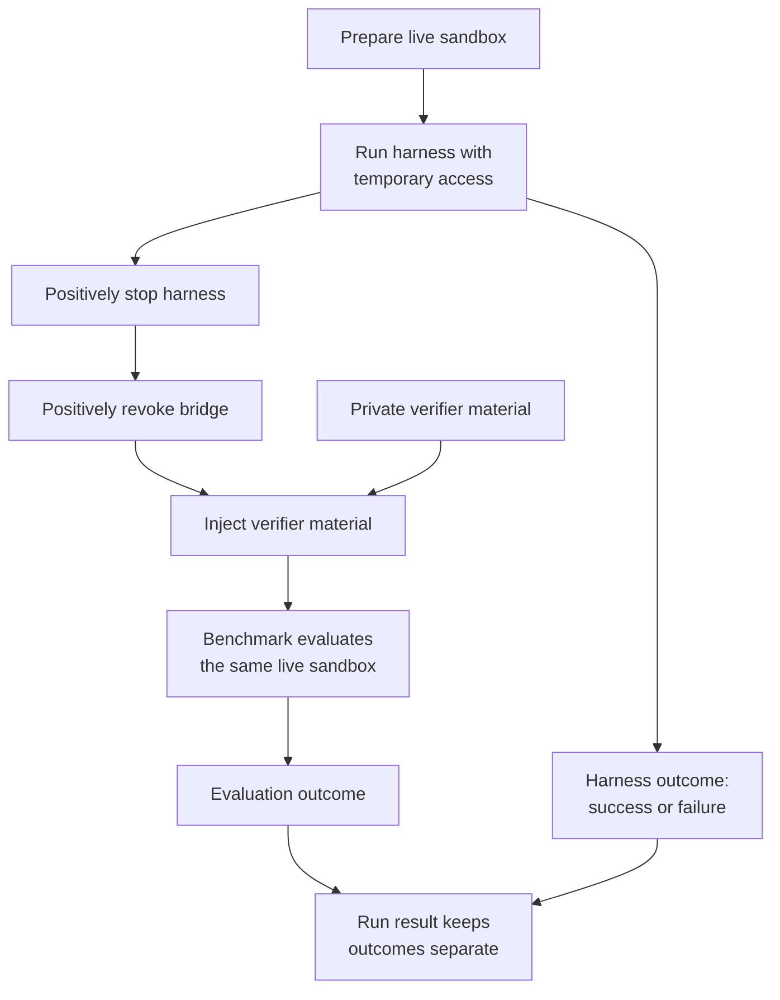

# Benchmark

`Benchmark` owns task meaning. It loads task definitions, prepares benchmark
inputs, sanitizes the live sandbox before agent access, and independently
evaluates the same sandbox after the harness is stopped and bridge access is
revoked.

## Boundary and lifecycle

Verifier tests and solutions remain private to the benchmark. They are not
placed in the sandbox until positive harness-stop and bridge-revocation gates
have both succeeded. Benchmark evaluation does not depend on whether the agent
harness reported success, and its result is recorded separately.

The current implementations are Terminal-Bench 2, Deep Research Bench, and
SWE-Atlas QA, all from an exact pinned checkout. Terminal-Bench 2's task
environment images and workdirs are derived from the selected task data;
setup verifies the pinned checkout and selected task inputs before a run.

Deep Research Bench has no sandbox-resident private verifier tree. Its private
material is a reference report and RACE-dimension rubric compared by an
LLM judge entirely host-side; that material is never uploaded into the
sandbox. `PrepareSandbox` instead confirms the agent's designated report-output
path starts absent, and `Evaluate` downloads the agent's report from that path
after both isolation gates before invoking the judge. The agent's research
work itself still runs entirely inside the sandbox, exactly like Terminal-Bench
2 — only grading moves host-side.

An optional FACT pass layers citation-trustworthiness checking on top of RACE:
it extracts claim/citation pairs from the same downloaded report, fetches each
cited URL host-side through the Jina AI Reader API, and validates the claim
against the fetched content with its own judge model. FACT is strictly
additive — configuring it (or not) never changes the RACE-derived score,
reward, or status.

SWE-Atlas QA combines both existing patterns: like Terminal-Bench 2, each
task has a sandbox-resident private verifier tree, injected only after both
isolation gates; like Deep Research Bench, grading is done by an LLM judge
against a rubric rather than a deterministic pass/fail script — except here
the judge-calling verifier script itself runs inside the sandbox rather than
host-side. It also works around one dataset-shape hazard neither existing
benchmark faces: its task file's declared verifier environment holds
shell-style template placeholders rather than literal secrets, so `Evaluate`
synthesizes the verifier's real environment fresh from the profile's judge
config instead of copying the task file's values through unmodified.

## Customization & Contribution Guide

Implement a new benchmark behind the existing `Benchmark` boundary: define its
task loading, pre-agent sandbox preparation, private verifier ownership, and live
sandbox evaluation in a concrete package. Expose an explicit constructor and
command switch, add tests that prove verifier secrecy and evaluation after both
isolation gates, and document setup and supported profiles. Do not introduce
registration, discovery, factories, reflection, DI, or generic plugins.
